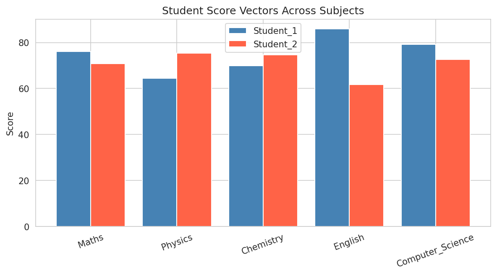
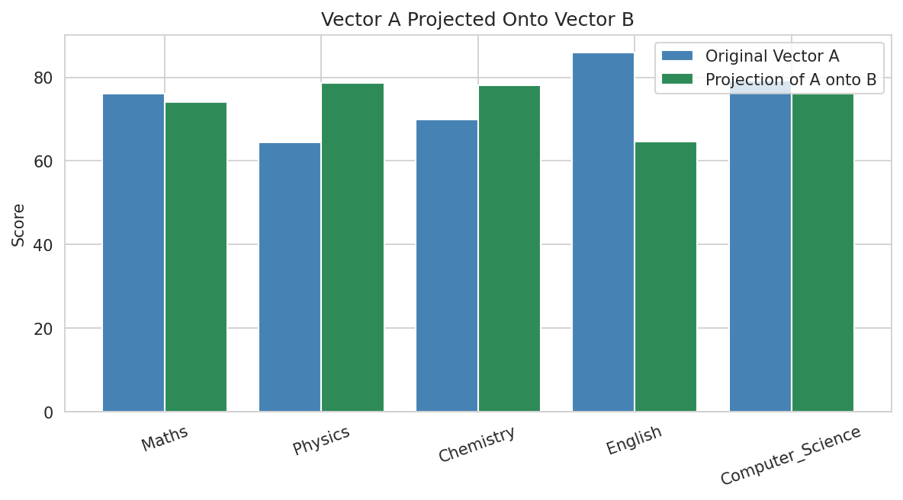
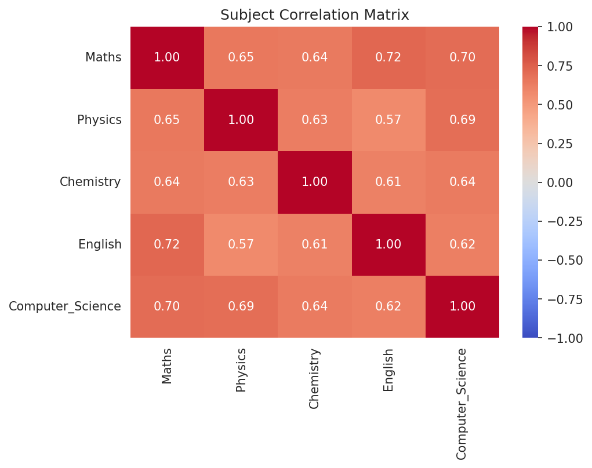
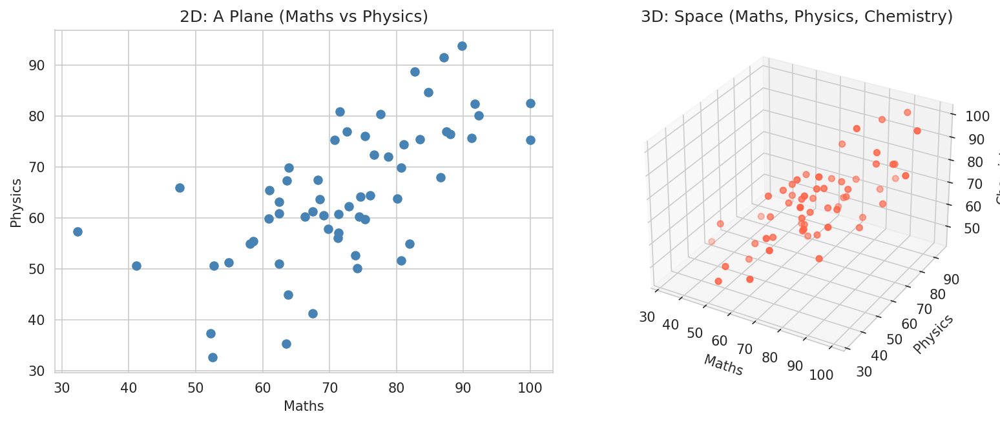
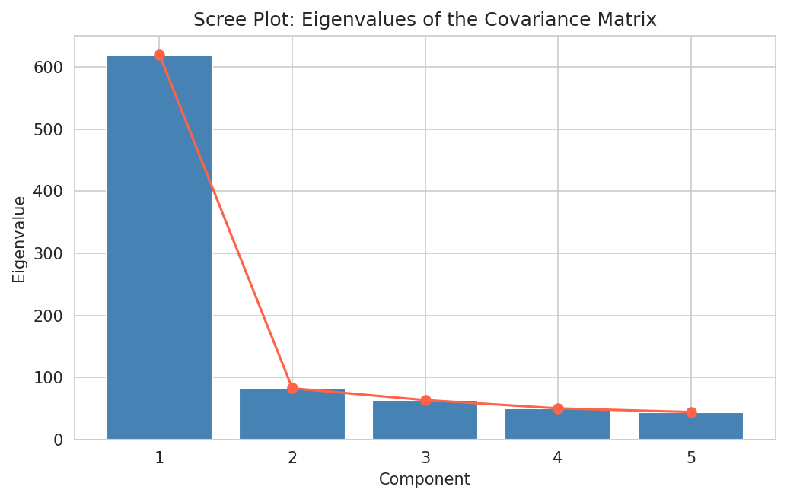
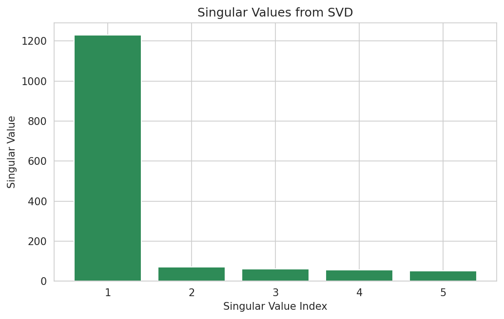
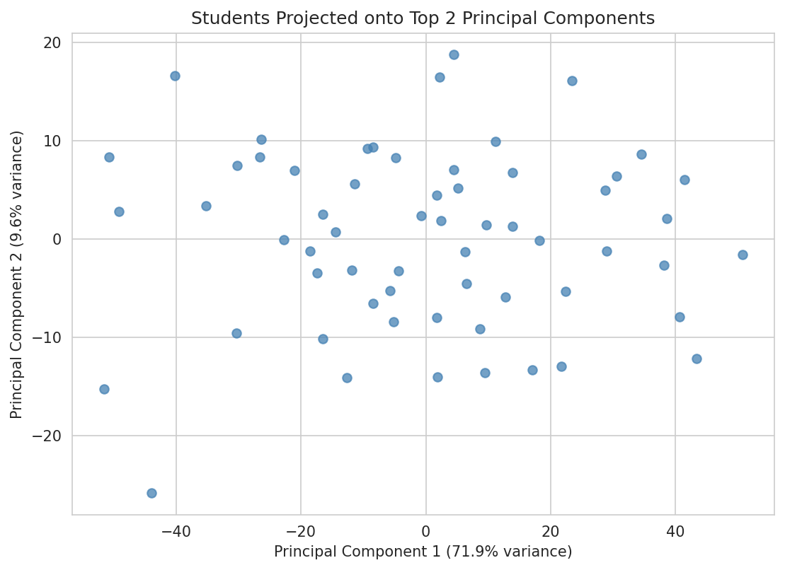
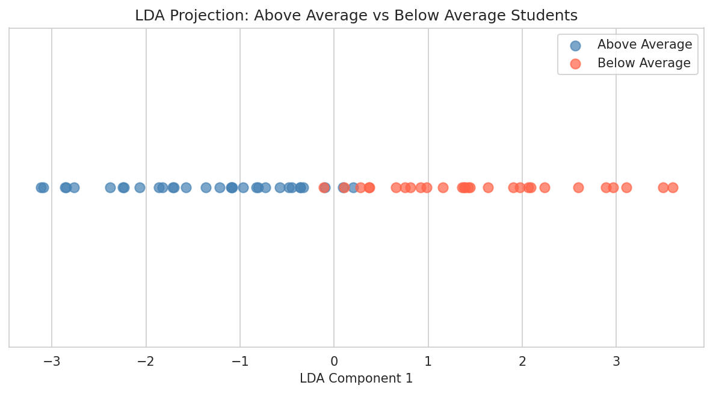

<p align="center">
  
</p>

<p align="center">
  
  
  
  
  
  
  
</p>

<p align="center">
  
  
  
</p>

<p align="center">
  <a href="https://github.com/Dhairyapatel1mc"></a>
  &nbsp;
  <a href="https://www.linkedin.com/in/ghost-patel-0267663b7/"></a>
  &nbsp;
  <a href="https://www.instagram.com/ghost_6927/?hl=en"></a>
</p>

---

<a name="toc"></a>
## 📌 Table of Contents

- [🎯 Project Overview](#-project-overview)
- [🎯 Project Objectives](#-project-objectives)
- [🚀 Features](#-features)
- [📊 Dataset Attributes](#-dataset-attributes)
- [📁 Project Structure](#-project-structure)
- [🧠 Statistical Concepts Used](#-statistical-concepts-used)
- [🧰 Technologies Used](#-technologies-used)
- [⚙️ Installation](#️-installation)
- [▶️ How to Run](#️-how-to-run)
- [📈 Visualizations](#-visualizations)
- [📄 Sample Results](#-sample-results)
- [🎓 Learning Outcomes](#-learning-outcomes)
- [💡 Future Improvements](#-future-improvements)
- [👤 Author](#-author)
- [⭐ Support](#-support)
- [🏆 Final Conclusion](#-final-conclusion)

---

## <a id="-project-overview"></a>🎯 Project Overview

**Calculative Foundation** applies core **Linear Algebra** concepts to a student-performance dataset to uncover the hidden structure behind exam scores. Working as a data analyst for a research institute, the task is to represent students as vectors, combine them into matrices, decompose those matrices, and ultimately compress a 5-subject dataset down to just 1–2 dimensions — without losing what matters.

This is a single, self-contained notebook covering vectors, matrices, decompositions, and dimensionality reduction, organized into 11 numbered tasks plus a final summary.

> 🏫 Prepared for **Red & White Skill Education** — Mathematics & Advanced Statistics module.

**[⬆ Back to top](#toc)**

---

## <a id="-project-objectives"></a>🎯 Project Objectives

- Represent each student's subject scores as a mathematical vector
- Compute norms, dot products, angles, cross products, and projections between students
- Perform core matrix operations — addition, multiplication, transpose, determinant, inverse
- Explain how lines, planes, and hyperplanes relate to increasing data dimensionality
- Extract eigenvalues and eigenvectors from the covariance matrix to find dominant patterns
- Decompose the data matrix using LU and SVD
- Reduce the dataset to 2D with PCA and classify students with LDA

**[⬆ Back to top](#toc)**

---

## <a id="-features"></a>🚀 Features

- 📓 One structured Jupyter notebook, broken into 11 clearly numbered tasks + a summary
- 🧮 Every core linear algebra operation demonstrated on real (synthetic) student data — not toy matrices
- 📊 8 exported chart images, so results can be viewed without opening Jupyter
- 🗣️ Every code cell is paired with a plain-English, student-voice markdown explanation
- 🔍 "Interpretation" notes after every graph, connecting the math back to what it means for the students
- 📋 A final summary table consolidating every method, result, and conclusion
- 🔁 Fully reproducible — fixed random seed, clean and minimal plotting code throughout

**[⬆ Back to top](#toc)**

---

## <a id="-dataset-attributes"></a>📊 Dataset Attributes

| Column | Type | Description |
|--------|------|-------------|
| `student_id` | string | Unique student identifier (e.g. S001) |
| `student_name` | string | Student name |
| `Maths` | float | Score out of 100 |
| `Physics` | float | Score out of 100 |
| `Chemistry` | float | Score out of 100 |
| `English` | float | Score out of 100 |
| `Computer_Science` | float | Score out of 100 |

60 students × 5 subjects — small enough to inspect by hand, large enough for meaningful matrix math.

**[⬆ Back to top](#toc)**

---

## <a id="-project-structure"></a>📁 Project Structure

```
.
├── README.md                              # You are here
├── calculative_foundation.ipynb           # Main analysis notebook (Tasks 1–12)
├── calculative_foundation_dataset.csv     # Student performance dataset
└── charts/                                # Exported chart images (PNG)
    ├── 01_student_score_vectors.png
    ├── 02_vector_projection.png
    ├── 03_subject_correlation_heatmap.png
    ├── 04_dimension_line_plane_space.png
    ├── 05_eigenvalue_scree_plot.png
    ├── 06_svd_singular_values.png
    ├── 07_pca_2d_projection.png
    └── 08_lda_classification.png
```

**[⬆ Back to top](#toc)**

---

## <a id="-statistical-concepts-used"></a>🧠 Statistical Concepts Used

Each task builds on the last. Here's what the code is actually doing at each step:

**1. Vectors** — Every student's row of subject scores is pulled out as a plain NumPy array. This is the basic unit of the whole project: a matrix is just many of these vectors stacked together.

**2. Norms, Dot Product & Angle** — `numpy.linalg.norm()` computes Norm-1 (sum of absolute values) and Norm-2 (Euclidean length) of a vector. The dot product, divided by the product of both vectors' norms, gives the cosine of the angle between them — a measure of how similarly shaped two students' performance profiles are, independent of their overall score level. `numpy.cross()` is used on a 3-subject subset since cross products are only defined in 3D.

**3. Vector Projection** — Using the formula `(A·B / |B|²) × B`, the code finds how much of Student A's vector points in the same direction as Student B's — the "shadow" one vector casts on another.

**4. Matrix Operations** — All 60 students are stacked into one `students × subjects` matrix. The code demonstrates addition, multiplication (a subset times its own transpose produces a student-similarity matrix), transpose, and determinant (`numpy.linalg.det`) to test invertibility of a square subset. A subject correlation matrix is also computed and visualized as a heatmap.

**5–6. Lines, Planes & Hyperplanes** — Plotting one subject is a line, two subjects is a 2D plane, three subjects is a 3D scatter. With all 5 subjects, the data technically lives in a 5D hyperplane that can't be drawn directly — which sets up the need for PCA.

**7. Eigenvalues & Eigenvectors** — `numpy.cov()` builds the covariance matrix of all subjects, and `numpy.linalg.eig()` extracts its eigenvalues and eigenvectors. Each eigenvector is a direction in the data; its eigenvalue is how much variance lies along it. Sorting by eigenvalue reveals which directions matter most.

**8. LU Decomposition** — `scipy.linalg.lu()` splits a square matrix subset into a permutation matrix `P`, a lower-triangular matrix `L`, and an upper-triangular matrix `U`, such that `P @ L @ U` reconstructs the original — the same mechanism solvers use to avoid computing a full matrix inverse.

**9. SVD** — `numpy.linalg.svd()` decomposes the *entire* matrix (not just a square subset) into `U`, `S`, and `Vt`. The singular values in `S` rank how much of the data's structure each component explains, and are the mathematical backbone of PCA.

**10. PCA** — `sklearn.decomposition.PCA` projects the 5-subject data onto its top 2 eigenvector directions, letting all 60 students be visualized on a single 2D scatter plot while retaining most of the original variance.

**11. LDA** — Students are labeled "Above Average" / "Below Average" by mean score, then `sklearn`'s `LinearDiscriminantAnalysis` finds the one direction that best separates those two groups — unlike PCA, which optimizes for spread, LDA optimizes for separability between known classes.

**[⬆ Back to top](#toc)**

---

## <a id="-technologies-used"></a>🧰 Technologies Used

<div align="center">


</div>

**[⬆ Back to top](#toc)**

---

## <a id="-installation"></a>⚙️ Installation

```bash
# Clone the repository
git clone <YOUR_REPO_URL>
cd calculative-foundation

# Install dependencies
pip install numpy pandas matplotlib seaborn scipy scikit-learn jupyter
```

**[⬆ Back to top](#toc)**

---

## <a id="-how-to-run"></a>▶️ How to Run

1. Make sure `calculative_foundation_dataset.csv` is in the project folder.
2. Launch Jupyter:
   ```bash
   jupyter notebook
   ```
3. Open `calculative_foundation.ipynb`.
4. Run all cells in order (**Cell → Run All**). Each task reuses variables from earlier tasks (e.g. the matrix `M` and eigen-decomposition), so cells should not be skipped.

**[⬆ Back to top](#toc)**

---

## <a id="-visualizations"></a>📈 Visualizations

| | |
|---|---|
|  |  |
|  |  |
|  |  |
|  |  |

**[⬆ Back to top](#toc)**

---

## <a id="-sample-results"></a>📄 Sample Results

| Task | Method | Key Result | Conclusion |
|---|---|---|---|
| Norms & Dot Product | L1/L2 Norm, Dot Product | Angle between two students' vectors | Quantifies similarity of performance patterns |
| Vector Projection | Projection formula | Projection scalar & vector | Shows shared direction between two students' profiles |
| Matrix Operations | Add, Multiply, Transpose, Determinant | Non-zero determinant on 4×4 subset | Subset matrix is invertible |
| Eigen-decomposition | Covariance matrix eigenvalues | Top eigenvalue's variance share | One dominant direction drives most score variation |
| LU Decomposition | `scipy.linalg.lu` | P, L, U reconstruct original matrix | Confirms solvability via triangular factors |
| SVD | `numpy.linalg.svd` | Ranked singular values | Confirms low-rank structure suitable for compression |
| PCA | sklearn PCA (2 components) | % variance retained in 2D | 5 subjects compress well into 2 dimensions |
| LDA | sklearn LDA (1 component) | Classification accuracy | Overall performance strongly separates the two groups |

*(Exact numeric values are computed live in the notebook and printed under each task.)*

**[⬆ Back to top](#toc)**

---

## <a id="-learning-outcomes"></a>🎓 Learning Outcomes

- How to represent real-world data as vectors and matrices
- How to compute and interpret norms, dot products, angles, and projections
- How to perform core matrix operations and test invertibility with the determinant
- How eigenvalues and eigenvectors reveal the dominant directions of variation in data
- How LU and SVD decompose a matrix into simpler, reusable building blocks
- How PCA and LDA use these same building blocks for dimensionality reduction and classification
- How to communicate linear algebra results clearly, pairing every result with a plain-English explanation

**[⬆ Back to top](#toc)**

---

## <a id="-future-improvements"></a>💡 Future Improvements

- Extend LDA to more than two performance categories (e.g. Low / Medium / High)
- Add a 3D interactive plot of the PCA components using Plotly
- Compare PCA vs. t-SNE / UMAP for non-linear dimensionality reduction
- Validate LDA with a proper train/test split instead of training accuracy alone
- Add unit tests for the vector and matrix helper functions

**[⬆ Back to top](#toc)**

---

## <a id="-author"></a>👤 Author

<table>
<tr>
<td valign="top">

**Ghost (Patel Dhairya)**

- 🏫 Red and White Skill Education (RWSkill)
- 💻 GitHub — [@Dhairyapatel1mc](https://github.com/Dhairyapatel1mc)
- 💼 LinkedIn — [ghost-patel](https://www.linkedin.com/in/ghost-patel-0267663b7/)
- 📷 Instagram — [@ghost_6927](https://www.instagram.com/ghost_6927/?hl=en)

</td>
<td align="center" valign="middle">

<a href="https://github.com/Dhairyapatel1mc"></a>
&nbsp;
<a href="https://www.linkedin.com/in/ghost-patel-0267663b7/"></a>
&nbsp;
<a href="https://www.instagram.com/ghost_6927/?hl=en"></a>

</td>
</tr>
</table>

**[⬆ Back to top](#toc)**

---

## <a id="-support"></a>⭐ Support

If this project helped you:

- ⭐ **Star** this repository
- 🍴 **Fork** it and adapt it for your own dataset
- 📤 **Share** it with your classmates
- 💬 **Open an Issue** for suggestions or bugs

**[⬆ Back to top](#toc)**

---

## <a id="-final-conclusion"></a>🏆 Final Conclusion

Student performance across 5 subjects is not made up of 5 independent signals — it's driven by a small number of underlying patterns. The eigen-decomposition and SVD both show a steep drop-off after the first component or two, and PCA confirms that most of the meaningful variance survives compression into just 2 dimensions. LDA further shows that a single combined "overall ability" direction is enough to reliably separate Above Average from Below Average students. In short: linear algebra turns 5 loosely related subject scores into a small set of interpretable, high-signal dimensions.

**[⬆ Back to top](#toc)**

---

<div align="center">


</div>
